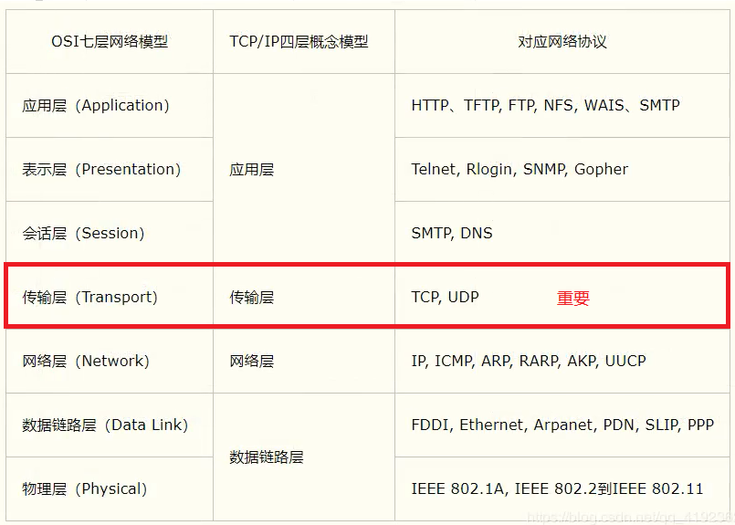

# 网络编程


## 1.1、 网络通信的要素

### 如何实现网络的通信：

#### 1. 通信双方的地址

- ip

- 端口号

#### 2. 规则：网络通信的协议

#### 		TCP/IP参考模型：




### 小结：

1. 网络编程中有两个主要的问题
    - 如何准确的定位到网络上的一台或多台主机
    - 找到主机之后进行通信
2. 网络编程中的要素
    - ip和端口号		ip
    - 网络通信协议     udp、tcp
3. 在Java中万物皆对象


## 1.2、 IP

ip地址：InetAddress

- 唯一确定一台网络上的计算机
- 127.0.0.1：本机  localhost
- 地址分类
    - IPv4 / IPv6
        - ==IPv4== 4个字节组成，0~255位，总共约42亿个，于2011年用尽。
        - ==IPv6==： 128位。8个无符号整数由0~9和 a~f组成
    - 公网（互联网）    私网（局域网）
        - ABCD类地址
        - 192.168.xxx.xxx，专门给组织内部使用


## 1.3、 端口

端口表示计算机上的一个程序的进程

- 不同的进程有不同的端口号！用来区分软件~
- 总共有65536个端口（0~65535），tcp和udp各有65536个端口

- 单个协议下端口号不能冲突

- 端口分类

    - 共有端口 0~1023

        - HTTP：80
        - HTTPS：443
        - FTP：21
        - Telent：23

    - 程序注册端口： 1024~49151，分配用户或者程序

        - Tomcat：8080
        - MySQL：3306
        - Oracle：1521

    - 动态、私有：49152~65535

        ```bash
        netstat -ano # 查看所有的端口
        netstat -ano | findstr "端口号" # 查看指定的端口号
        tasklist | findstr "端口号" # 查看指定端口号的进程
        CTRL + SHIFT + ESC # 打开任务管理器
        ```


## 1.4、 通信协议

**网络通信协议 **：规定了速率，传输码率，包结构，传输控制等

### TCP/IP协议簇（一组协议）：

- 重要的连接
    - TCP：传输控制协议
    - UDP： 用户数据报协议
    - IP


TCP、UDP对比

- TCP
    - 有链接，稳定
    - `三次握手`，`四次分手`
    - 客户端、服务端
    - 传输完成、释放连接，效率低

- UDP
    - 无链接、不稳定
    - 客户端、服务端没有明确的界限
    - 不保证传输的可靠性


## 1.5、 TCP

### 消息传递

客户端

1. 连接服务器Socket
2. 发送消息

```java
public class TcpClientDemo01 {
    public static void main(String[] args) {
        Socket socket = null;
        OutputStream os = null;
        try {
            // 1. 要知道服务器的地址，端口号
            InetAddress serverIp = InetAddress.getByName("127.0.0.1");
            Integer port = 9999;

            // 2. 创建一个socket连接
            socket = new Socket(serverIp, port);

            // 3. 发送消息 IO流
            os = socket.getOutputStream();
            os.write("你好".getBytes());

        } catch (Exception e) {
            e.printStackTrace();
        } finally {
          // 关闭资源
          if (os != null){
              try {
                  os.close();
              } catch (IOException e) {
                  e.printStackTrace();
              }
          }
          if (socket != null){
              try {
                  socket.close();
              } catch (IOException e) {
                  e.printStackTrace();
              }
          }
        }
    }
}
```


服务器

1. 建立服务的端口 ServerSocket
2. 等待用户的链接 accept
3. 接受用户的消息

```java
public class TcpServerDemo1 {
    public static void main(String[] args) throws IOException {
        ServerSocket serverSocket = null;
        Socket socket = null;
        InputStream is = null;
        ByteArrayOutputStream baos = null;
        try {
            // 1. 创建一个地址
            serverSocket = new ServerSocket(9999);

            // 2. 等待客户端连接
            socket = serverSocket.accept(); // 此时的socket就是客户端链接过来的socket

            // 3. 读取客户端的消息
            is = socket.getInputStream();

//            byte[] buffer = new byte[1024];
//            int len;
//
//            while((len = is.read(buffer)) != -1){
//                String msg = new String(buffer, 0 , len);
//                System.out.println(msg);
//            }

            // 管道流
            baos = new ByteArrayOutputStream();
            byte[] buffer = new byte[1024];
            int len = 0;
            while((len = is.read(buffer)) != -1){
                baos.write(buffer, 0, len);
            }

            // 无论多长，因为我们输出的时候他已经拼完了
            System.out.println(baos.toString());

        } catch (IOException e) {
            e.printStackTrace();
        }finally {
            // 关闭资源
            if (baos != null) {
                baos.close();
            }
            if (is != null) {
                is.close();
            }
            if (socket != null) {
                socket.close();
            }
            if (serverSocket != null) {
                serverSocket.close();
            }
        }
    }
}
```


### 文件上传

服务器端：

```java
public class TcpServerDemo02 {
    public static void main(String[] args) throws Exception {
        // 1.创建服务
        ServerSocket serverSocket = new ServerSocket(9000);
        // 2.监听客户端的链接
        Socket socket = serverSocket.accept(); // 阻塞式监听，会一直等待客户端连接
        // 3.获取输入
        InputStream is = socket.getInputStream();
        // 4.文件输出
        FileOutputStream fos = new FileOutputStream(new File("receive2.jpg")); //管道流

        byte[] buffer = new byte[1024];
        int len;
        while ((len = is.read(buffer)) != -1){
            fos.write(buffer, 0, len);
        }

        // 通知客户端我接受完毕了
        OutputStream os = socket.getOutputStream();
        os.write("我接收完毕了".getBytes("utf-8"));

        // 5.关闭资源
        fos.close();
        is.close();
        socket.close();
        serverSocket.close();

    }
}
```


客户端：

```java
public class TcpClientDemo02 {
    public static void main(String[] args) throws Exception {
        // 1.创建一个Socket链接
        Socket socket = new Socket(InetAddress.getByName("127.0.0.1"), 9000);

        // 2.创建一个输出流
        OutputStream os = socket.getOutputStream();

        // 3.读取文件流
        FileInputStream fis = new FileInputStream(new File("A梦.jpg"));

        // 4.写文件
        byte[] buffer = new byte[1024];
        int len;
        while((len = fis.read(buffer)) != -1){
            os.write(buffer, 0, len);
        }

        // 通知服务器，我已经传输完成了
        socket.shutdownOutput();

        // 确定服务器接受完毕，才能够断开连接
        InputStream is = socket.getInputStream();

        byte[] buffer2 = new byte[1024];
        int len2;

        ByteArrayOutputStream baos = new ByteArrayOutputStream();
        while ((len2 = is.read(buffer2)) != -1){
            baos.write(buffer, 0, len2);
        }

        System.out.println(baos.toString());

        // 5.关闭流
        fis.close();
        os.close();
        socket.close();
    }
}
```


### Tomcat：轻量级的web服务器


## 1.6、 UDP

不用连接、但要地址


### 发送消息：

```java
public class UdpClientDemo01 {
    public static void main(String[] args) throws Exception {
        // 1. 建立一个Socket
        DatagramSocket socket = new DatagramSocket();

        // 2.建立数据包
        String msg = "你好，服务器";
        // 数据， 数据的起始和终止， 目标地址， 端口
        DatagramPacket packet = new DatagramPacket(msg.getBytes(), 0, msg.getBytes().length, InetAddress.getByName("127.0.0.1"), 9000);

        // 3.发送数据包
        socket.send(packet);

        // 4、关闭流
        socket.close();
    }
}
```


### 接收消息:

```java
public class UdpServerDemo01 {
    public static void main(String[] args) throws Exception {
        // 开放端口
        DatagramSocket socket = new DatagramSocket(9000);

        //接收数据
        byte[] buffer = new byte[1024];
        DatagramPacket packet = new DatagramPacket(buffer, 0, buffer.length);

        socket.receive(packet); // 阻塞接受

        System.out.println(packet.getAddress().getHostName());
        System.out.println(new String(packet.getData(), 0, packet.getLength()));

        // 关闭连接
        socket.close();
    }
}
```


### 循环发送消息：

```java
public class UdpSenderDemo01 {
    public static void main(String[] args) throws Exception {
        DatagramSocket socket = new DatagramSocket(9000);

        BufferedReader reader = new BufferedReader(new InputStreamReader(System.in));
        while (true){
            String msg = reader.readLine();

            //                                                                                         new InetSocketAddress("localhost", port)
            DatagramPacket packet = new DatagramPacket(msg.getBytes(), 0, msg.getBytes().length, InetAddress.getByName("localhost"), 9001);

            socket.send(packet);

            if (msg.equalsIgnoreCase("bye")){
                break;
            }
        }

        socket.close();
    }
}
```


### 循环接收消息：

```java
public class UdpReceiverDemo01 {
    public static void main(String[] args) throws Exception {
        DatagramSocket socket = new DatagramSocket(9001);

        while (true){
            byte[] container = new byte[1024];
            DatagramPacket packet = new DatagramPacket(container, 0, container.length);

            socket.receive(packet);

            // 断开连接
            byte[] data = packet.getData();
            String receiveData = new String(data, 0, packet.getLength());
            System.out.println(receiveData);

            if (receiveData.equalsIgnoreCase("bye")){
                break;
            }
        }

        socket.close();
    }
}
```


### 在线咨询：两个人都可以是发送方，也可以是接收方


## 1.7、 URL（Uniformed Rosource Location）

统一资源定位符：定位资源，定位互联网上的某一个资源

DNS域名解析： 将域名解析成IP地址

组成：`协议` + `IP地址` + `端口` +`项目名` + `资源路径`

```
协议://ip地址:端口/项目名/资源
```


